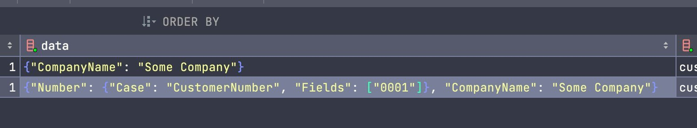
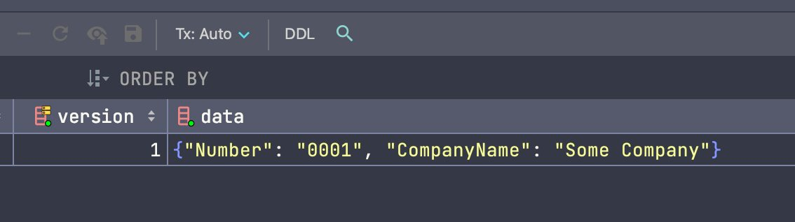

# MartenFSharpTypeAliases

This sample shows an Event Sourcing implementation with [Marten DB](https://github.com/JasperFx/marten) and F#.

The [Domain Model](https://github.com/AlexZeitler/MartenFSharpTypeAliases/blob/main/src/MartenFSharpTypeAliases/Program.fs#L1) contains Type Aliases as described [here](https://www.softwarepark.cc/blog/2020/8/7/understanding-f-type-aliases).

The challenge was to get the Marten serializer to serialize the Type alias for [`CustomerNumber`](https://github.com/AlexZeitler/MartenFSharpTypeAliases/pull/1/commits/01f7c18d91430587e45ee61a83999082ce4f4371#diff-31655bed81bf8bd885fcc466f70e90eec6ab2802a1cee0966f27e17ac2b5cdefR3) instead of this:

 

to this:

The solution evolved in two steps: [Commit 1](https://github.com/AlexZeitler/MartenFSharpTypeAliases/pull/1/commits/01f7c18d91430587e45ee61a83999082ce4f4371), [Commit 2](https://github.com/AlexZeitler/MartenFSharpTypeAliases/pull/1/commits/0ecdfdcb7599a7cfe1637d4a15764ea1ebb9e62b).

Thanks to [Isaac Abraham](https://github.com/isaacabraham) for getting this done!